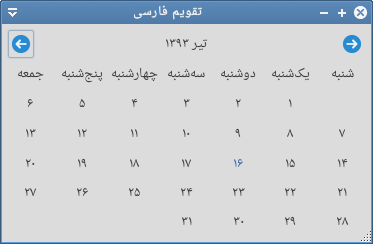

Persian-Calendar
================
Simple persian calendar written in c


Screenshot
================



Build
================
```
sudo apt-get install git build-essential libgtk-3-dev libjalali-dev
git clone https://github.com/AhmadHamzeei/Persian-Calendar.git
cd Persian-Calendar
make
```


Run
================
launch calendar.out after building.
